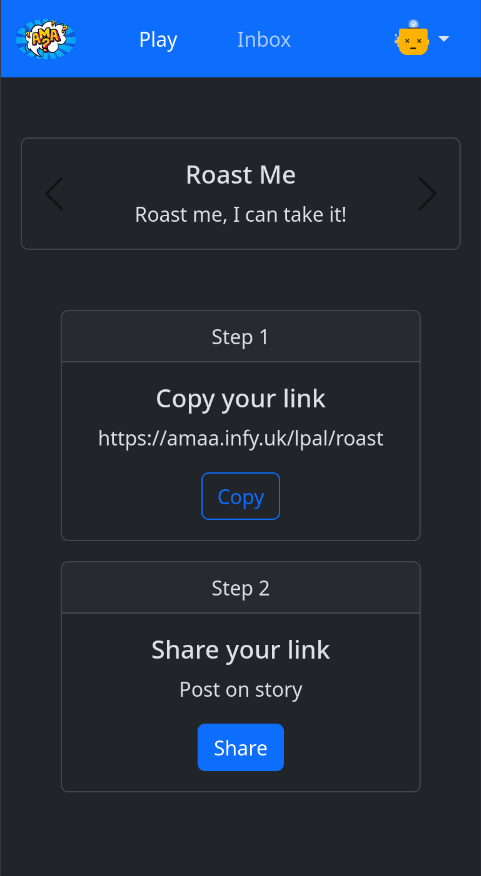
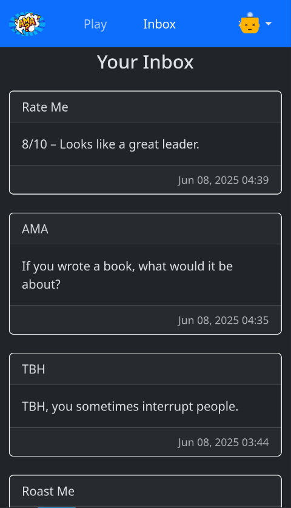
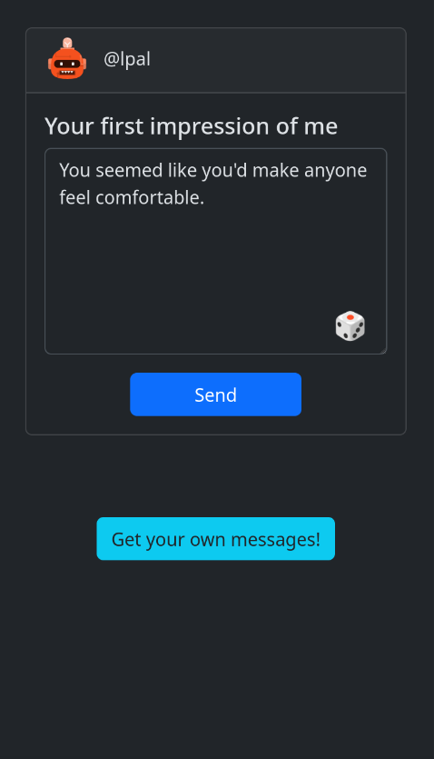
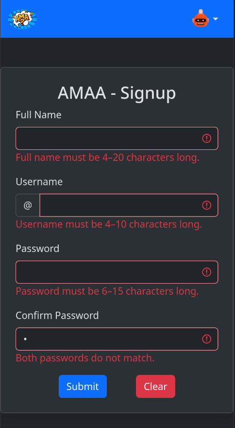

# 📨 AMAA App — Anonymous Message App

A fun and engaging social web app where users receive anonymous messages from
friends, followers, or strangers. Inspired by popular apps like NGL and Sarahah,
AMAA offers multiple message categories such as AMAA (Ask Me Anything),
Confessions, TBH (To Be Honest), NHIE (Never Have I Ever), and many more —
bringing a fresh and organized twist to anonymous messaging.

## 🌐 Live Demo

Check it out live at [https://amaa.infy.uk/](https://amaa.infy.uk/)

## Previews






---

## 🌟 Features

- 🔐 Secure user authentication with session management
- 🧾 Unique shareable links for receiving anonymous messages
- 💬 Multiple categorized message types:

  - AMA (Ask Me Anything)
  - Confessions
  - TBH (To Be Honest)
  - NHIE (Never Have I Ever)
  - Ship Me
  - Dealbreaker
  - 3 Words
  - And more!
- 📬 Private message inbox with timestamped messages
- 🛡️ Robust CSRF protection on all forms
- 🔎 SEO optimized with dynamic meta tags per user and category
- 🎨 Clean, responsive Bootstrap 5 UI with built-in dark mode support
- 🛠️ Prepared statements to prevent SQL injection
- 💻 Simple deployment using PHP & MySQL (compatible with Apache or built-in
  server)

---

## 🚀 Getting Started

### Prerequisites

- PHP 8.0 or higher
- MySQL or MariaDB
- Apache web server or use PHP's built-in server

### Installation Steps

1. **Clone the repository**

```bash
git clone https://github.com/LakhindarPal/amaa-app.git
cd amaa-app
```

2. **Set up the database**

- Create a database, e.g., `amaa_app`
- Import the schema:

```bash
mysql -u youruser -p amaa_app < database/schema.sql
```

3. **Configure database connection**

- Edit `database/connect.php` or create a `.env` file with your credentials:

```php
$servername = "localhost";
$username = "root";
$password = "";
$dbname = "amaa_app";
```

4. **Run the application**

- Option A: Built-in PHP server

```bash
php -S localhost:8000
```

- Option B: Apache server Ensure `.htaccess` supports rewriting and 404
  handling:

```apacheconf
ErrorDocument 404 /404.php
```

---

## 📁 Project Structure

```
amaa-app/
├── database/
    ├── connect.php
│   └── schema.sql
├── data/
│   ├── categories.php
│   └── suggestions/
├── partials/
│   ├── head.php
│   ├── footer.php
│   └── navbar.php
├── assets/
│   ├── favicon.jpg
│   └── logo.jpg
├── send.php
├── signup.php
├── login.php
├── logout.php
├── inbox.php
├── success.php
├── 404.php
└── index.php
```

---

## 🛡️ Security Considerations

- Use of prepared statements for all database queries to prevent SQL injection
- CSRF tokens implemented and validated for all POST forms
- Session-based authentication to protect user data
- Proper output escaping (`htmlspecialchars`) to avoid XSS
- Passwords stored securely (hashing recommended in signup/login)

---

## 🚧 Future Improvements

- 🎨 **Custom Avatar Upload:** Allow users to upload their own profile avatars
  instead of using default generated images
- 🤖 **AI-powered Reply Suggestions:** Integrate AI/NLP models to suggest
  replies or help users craft messages
- 📄 **Pagination in Inbox:** Implement pagination or infinite scroll for
  message inboxes to improve UX with large message volumes
- 🔍 **Inbox Filtering & Search:** Allow users to filter messages by category,
  date, or keyword for easy navigation
- 🗑️ **Delete Inbox Messages:** Add the ability for users to delete unwanted
  messages from their inbox
- 🔔 **Real-time Notifications:** Push notifications or live updates for new
  messages

---

## 📢 Contributing

Contributions and feedback are highly appreciated!

1. Fork the repository
2. Create a new feature branch (`feature/your-feature`)
3. Commit your changes with clear messages
4. Push the branch and open a Pull Request

---

## 📄 License

This project is licensed under the [MIT License](LICENSE) — free to use, modify,
and distribute.

---

## 📬 Contact

Developed by [Lakhindar Pal](https://github.com/LakhindarPal). Feel free to
reach out with questions, suggestions, or collaboration ideas!
